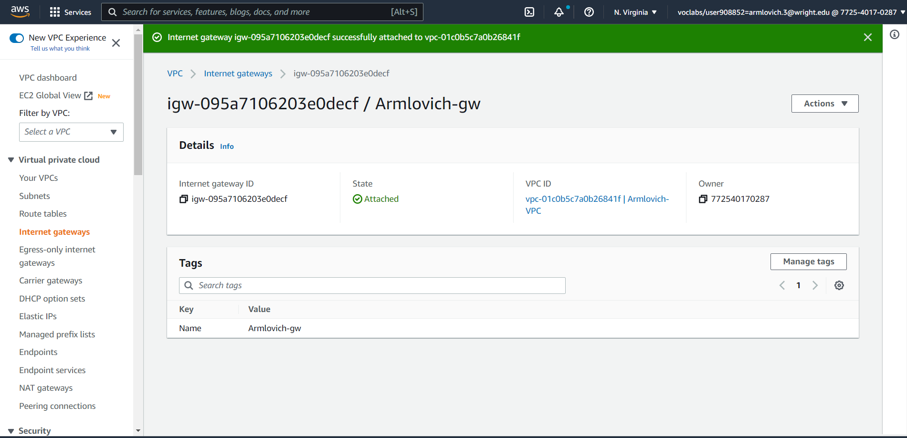

# Part 1

1. Create a VPC tagged with "Armlovich-VPC" with a /24 private IP range.
   - 

2. Create a subnet tagged with "Armlovich-Subnet" specified with a /28 IP range and attached to VPC
   - 

3. Create an internet gateway tagged with "Armlovich-gw" attched to VPC associated with the subnet.
   - 

4. Create a route table tagged with "Armlovich-routetable" attached to VPC, associated with the subnet, add a routing table rule that sends traffic to all destinations to your gateway.
   - 

5. Create a security group tagged with "Armlovich-sg" allowing for SSH for a set of trusted networks including:
   1. your home / where you usually connect to your instances from
   2. Wright State (address starting with 130.108)
   3. Instances within the VPC
   - attach the SG to the VPC and include the Inbound Rules
   - 
   - 

6. (If necessary, else skip) Create a key pair

## Part 2

1. Create a new instance with a write up of the following information:
   - AMI selected (default username of the instance type selected
   - Instance type selected

2. Attach the instance to the VPC, explain how it was done.
   - 

3. Determine whether a Public IPv4 address will be auto-assigned to the instance, justifying why I did or did not do it (next steps require requesting an Elastic IP address and associating it to the instance. Factor that into your discussion here).

4. Attach a volume to the instance, as discussed there are different ways to do this, explain how and why I did it that way.
   - 

5. Tag your instance with a "Name" of "Armlovich-instance" and explain how it was done.
   - 

6. Associate your security group, "Armlovich-sg" to your instance and say how it was done.
   - 

7. Reserve an Elastic IP address, tagged with "Armlovich-EIP", associated with your instance, and explain how it was done.
   - 

8. Create a screenshot of the instance and add it to the project write up.
   - 

9. `ssh` into the instance, change hostname to "Armlovich-AMI" where AMI is some version of the AMI you chose, explain how it was done.
   - 

10. Create a screenshot of the ssh connection to the instance and add it to the project write up, make sure it shows the new hostname.
   - 
